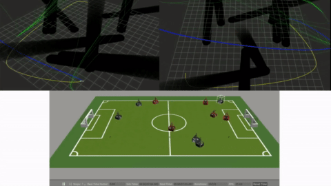
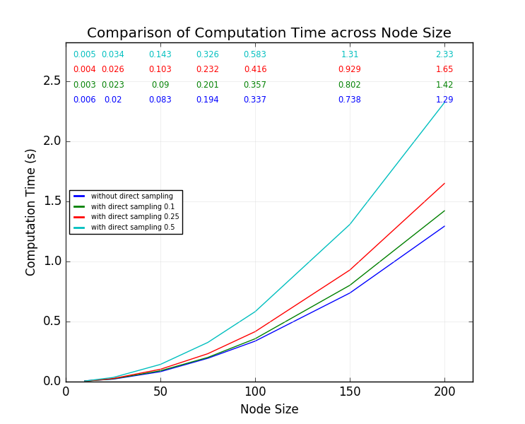
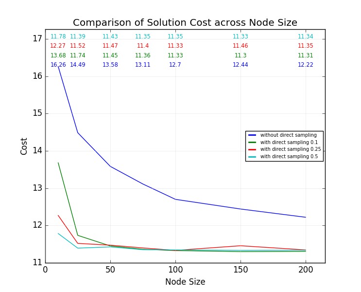
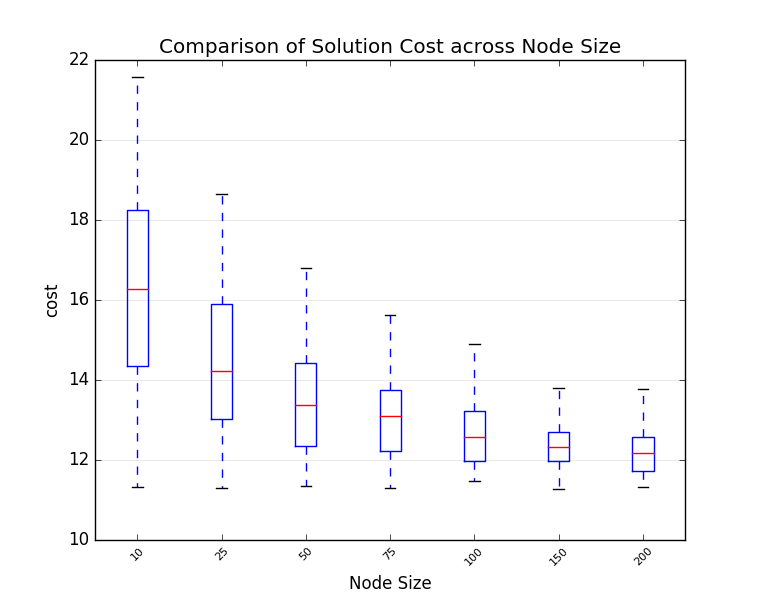
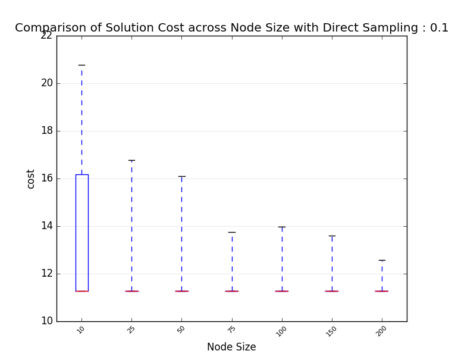

## Kinodynamic Motion Planning in Dynamic Environment for robot soccer
  
click [here](https://youtu.be/jYTKOSrrcoY) to view full video. Or [here](https://www.youtube.com/playlist?list=PL2Kn-ntDzDZsU3pb30TBWnRmIcATtSVu8) for more videos.  

### Detailed Description
Read the [thesis](https://bitbucket.org/alifahrri/bachelor-thesis/src/master/build/thesis.pdf) or [paper](https://bitbucket.org/alifahrri/bachelor-thesis/src/master/build/paper.pdf)  

### You'll need :
- ROS
- gcc >= 7 (for C++17)
- Cython
- [google benchmark](https://github.com/google/benchmark)

### Cloning  
do recursive cloning :   
```
git clone --recursive https://alifahrri@bitbucket.org/alifahrri/robosoccer_motion_planning_ws.git
```

### Building 
standard ROS build, but it is recommended to use only single thread since it will take huge amount of RAM.  
```
catkin_make -j1
```

### Running Unit Tests
run unit test setting from catkin
```
catkin_make -j1 run_tests
```

### Run Benchmark
use google benchmark settings 
```
rosrun rrtstar rrtstar_benchmark
```
custom settings (report min, max, mean also prints individual test results)
```
rosrun rrtstar rrtstar_custom_benchmark
```

### Performance   
tested on intel i3   

|               computation time | solution cost                  |
|-------------------------------:|--------------------------------|
|  |  |  
   
|                                                       no direct sampling | direct sampling with prob = `0.1`                                      |
|-------------------------------------------------------------------------:|------------------------------------------------------------------------|
|  |  |

### Nodes
* the core of the motion planning algorithm `robosoccer_motion_planning/src/robosoccer_motion_planning_node`
* trajectory tracking node for robot soccer `robosoccer_trajectory_tracking/scripts/trajectory_cytracker.py` 
* control robots with waypoints `robosoccer_teleop/scripts/robosoccer_teleop_node.py`
* example of trajectory generator as server node `robosoccer_motion_planning/src/trajectory_generator_node`
* example of trajectory generator client node `robosoccer_motion_planning/scripts/trajectory_demo.py`
   
### Launcher
* run all necessary nodes (core, trajectory tracking, and teleop) : `robosoccer_bringup.launch`   
* record necessary messages with rosbag : `recorder.launch`. Launch it after bringup.
* play recorded bag files (this will shows visualisation and plotter) : `player.launch file:=your_file_full_path.bag`
